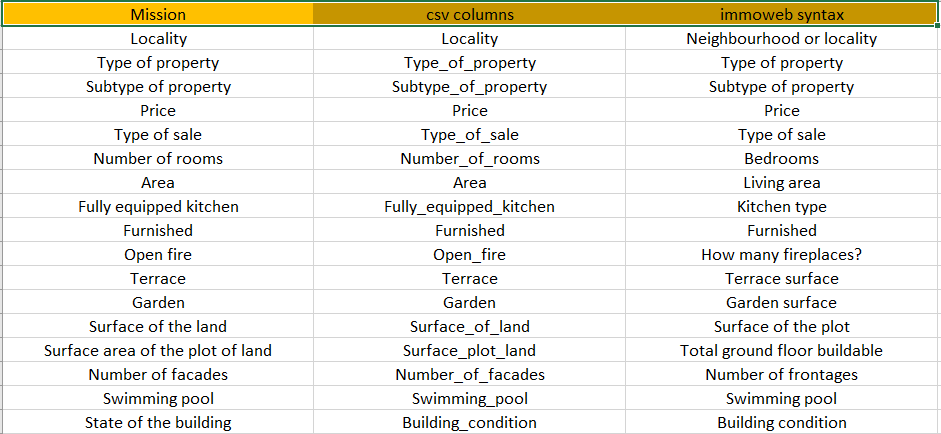

# ImmoWeb Scraping

## Description

This project is about creating a large dataset on real estate for price prediction purposes.
For that reason, we have chosen to collect data from immoweb website. We have chosen immoweb
because it's the number one real estate company in Belgium. So we are to collect data from all
localities in Belgium and also we have the opportunity to collect a large quantity of data.

Our mission is to collect the following informations:

## Installation

In order to achieve our mission of collecting the above informations, we'll be using the following tools:
- Python language
- Selenium library
- pyquery library

We are using Python because it's the best programming language in data science, big data and machine learning.
We prefer to use **selenium** instead of **requests** because requests has some limitation. We noticed that, when there are some javascript functionalities, requests is not efficient for grabbing some information.
Finally, we noticed that **Beautifulsoup** is a bit slow for handling large amount of data. That's why we used **pyquery**.

So, make sure to have these tools installed on your computer or your virtual environment.

## Usage

Put the following files in the same folder:

- chromedriver.exe
- get_links.py
- get_properties_details.py
- main.py

Open your terminal and move to the folder contenaining all these files. Make sure to activate your virtual environment. Then run `python main.py`

Lastly, check the **all_properties_info.csv** file generated to see all the dataset.